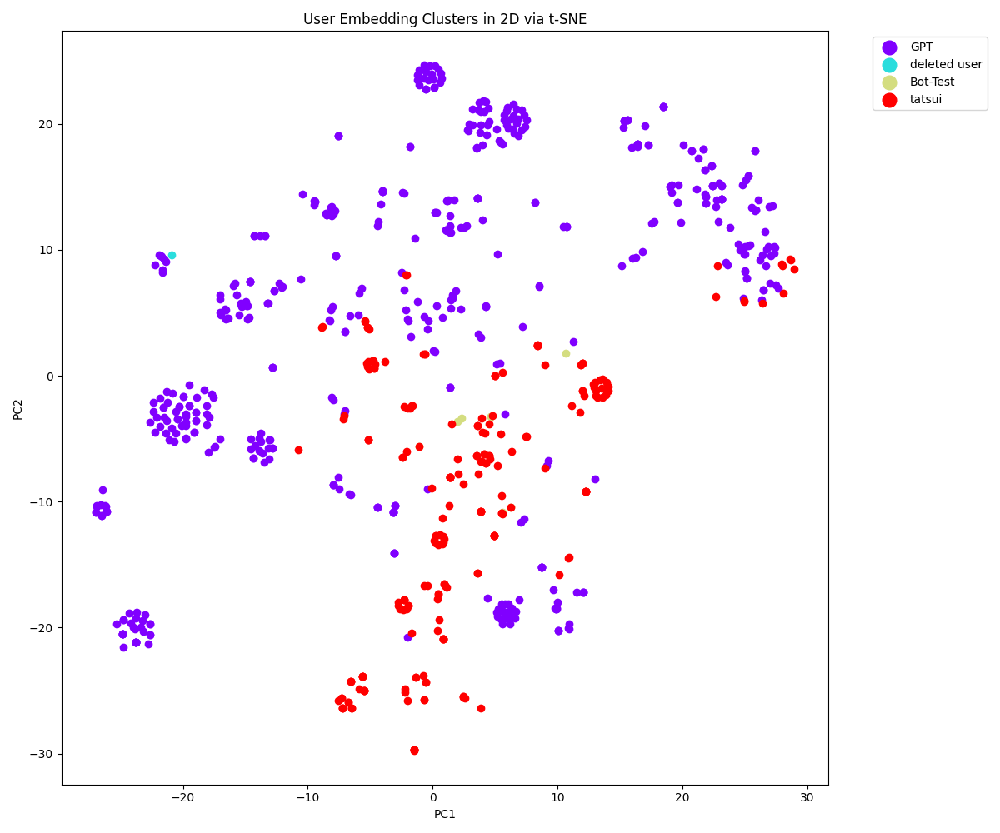

# Slack Team Analyzer

Slackのコミュニケーションにおける分析、特に参加度のバランス、意見の多様性、決定過程の透明性などの指標に基づく分析は、心理的安全性に重要な影響を与えることがあります。  
心理的安全性とは、個人がリスクを冒しても罰せられないと感じる環境のことを指します。  
この分析が心理的安全性に与える影響は以下のように考えられます：

1. **信頼と開放性の促進**: チームメンバーが平等に参加していると感じ、自分の意見が受け入れられる環境があれば、信頼感と開放性が高まります。

2. **意見の多様性の尊重**: 異なる意見や視点がチャンネルやスレッドで共有され、それらが尊重される文化が形成されると、メンバーは自分の考えを自由に表現しやすくなります。

3. **透明性と公平感**: 決定過程が透明で、情報が公平に共有されることは、メンバーがチームや組織に対して公正さを感じることにつながります。

4. **フィードバックのポジティブな文化**: 良質なフィードバックが奨励される文化は、成長と学習の機会を提供し、心理的安全性を高めることに役立ちます。

5. **問題点の早期発見と対処**: コミュニケーションのボトルネックや不均衡が早期に発見されると、それらに対処し、不満や誤解を解消する機会が生まれます。

しかし、このような分析は慎重に行う必要があります。過度に監視されていると感じると、メンバーは自己表現を控えるようになり、逆に心理的安全性が損なわれる可能性があります。  
分析の目的は、チームのコミュニケーションを改善し、協力的な環境を促進することであり、個々のメンバーを評価したり、監視することではありません。  
重要なのは、分析から得られた洞察を、チーム全体の利益のために使うことです。

## :fire: 会話分析を個人スキル評価に活用する危険性について
Slackコミュニケーションと個人スキル評価を同時に行うことにはいくつかの危険性があります。以下に主なリスクを述べます：

1. **プライバシーの侵害**: 個人のチャット履歴(特にDMやプライベートチャンネル)を分析することは、プライバシーの侵害となり得ます。従業員は、自分のコミュニケーションが常に監視されていると感じる可能性があります。

2. **信頼の喪失**: 従業員がコミュニケーションが評価の対象となっていると知った場合、上司や組織への信頼を失う可能性があります。

3. **コミュニケーションの自然さの損失**: コミュニケーションが評価の対象となることを意識すると、従業員は自然なコミュニケーションを避け、自己検閲を行うようになるかもしれません。

4. **文脈の誤解**: チャットの文脈はしばしば複雑であり、誤解されやすいです。これにより、誤った評価や不公平な判断が生じる可能性があります。

5. **非言語的コミュニケーションの欠如**: Slackなどのテキストベースのコミュニケーションツールは、非言語的要素（トーン、表情など）を伝えることができません。これにより、誤解が生じやすくなります。

6. **一様な評価基準の適用**: すべての従業員に同じコミュニケーションスタイルを期待することは現実的ではなく、多様性と個々の強みを無視することになりかねません。

7. **ストレスと圧力の増大**: 常に評価されているという感覚は、従業員にストレスや圧力を与え、職場の雰囲気を悪化させる可能性があります。

8. **創造性と自発性の抑制**: 従業員が自分の言動を常に評価されると感じると、リスクを冒して新しいアイデアを提案することを避けるようになるかもしれません。

これらの理由から、Slackコミュニケーションと個人スキル評価を組み合わせる際には、倫理的かつ合理的なアプローチが必要です。  
従業員の同意を得る、明確な目的とガイドラインを設定する、プライバシーを尊重するなどの措置が重要です。  

## 会話の評価指標について
以下の指標を用いて自然言語処理を行うことで、Slackのコミュニケーションにおける問題点を特定します。

1. **レスポンス時間**: 各メンバーがメッセージに応答するまでの時間を測定します。遅延はコミュニケーションの流れに影響を及ぼす可能性があります。

2. **メッセージの明瞭さ**: メッセージがどれだけ明確かを評価します。専門用語の過度な使用や曖昧な表現は理解のボトルネックになり得ます。

3. **参加度のバランス**: すべてのメンバーが議論に均等に参加しているかどうかを確認します。あるメンバーが過度に支配すると、他のメンバーの貢献が減少する可能性があります。

4. **意見の多様性**: チームメンバーの意見の多様性を評価します。多様な視点が共有されていない場合、重要な視点が見逃される可能性があります。

5. **決定過程の透明性**: 決定がどのようにして行われているかを明確にします。不透明なプロセスは不信感や誤解を生む可能性があります。

6. **フィードバックの質と量**: チームメンバーが互いにどの程度助言やフィードバックを提供しているかを検討します。適切なフィードバックは効率的なコミュニケーションを促進します。

## インストール
```bash
pip install -r requirements.txt
```

## 使い方

はじめに[Slack Apps](https://api.slack.com/apps/)を作成し以下の権限を追加します。
トークンはそれぞれ`SLACK_BOT_TOKEN`と`SLACK_USER_TOKEN`という名前で設定します。  
* SLACK_BOT_TOKEN
    * channels:history
    * users:read

* SLACK_USER_TOKEN
    * search:read
    * channels:history

### チャンネルを分析する
チャンネルIDを指定し、チャンネルのメッセージをダンプします。
```bash
python dump_channel.py <チャンネルID>
```

会話の分析
```bash
python analysis_messages.py -c <チャンネルID> -l
ユーザー別総メッセージ数: {'<@U067Z40EWBZ>': 284, '<@U03RM7Z5GKX>': 219}
ユーザー別の平均応答時間（分）: {'<@U03RM7Z5GKX> -> <@U067Z40EWBZ>': 1.036152673876593, '<@U067Z40EWBZ> -> <@U03RM7Z5GKX>': 35.47403147954545}
会話の総期間（時間）: 1.2578323478737998
総メッセージ数: 503
総スレッド数: 81
message_clarity: メッセージの内容は比較的明確であり、特定の指示やリクエストに基づいた情報の提供が求められています。
participation_balance: 主に一方のユーザーからのリクエストともう一方のユーザーからの応答が見られます。全体としてはバランスの取れた参加ではなく、主導的な役割と対応する役割が分かれています。
opinion_diversity: チャット履歴には異なる意見や視点が少なく、主に事実確認や情報提供のやりとりが中心となっています。
decision_making_transparency: 決定や選択のプロセスは明確であり、特定のユーザーのリクエストに基づいてアクションがとられています。
quality_and_quantity_of_feedback: リクエストに対するフィードバックは質が高く、要求された情報や指示に対して適切な応答が行われていますが、フィードバックの量は限られています。
summary: 全体として、チャット履歴は一方のユーザーからの具体的な要求に基づいて、他方が情報を提供する形式で進行しています。意見の多様性は少なく、対話は主に情報交換に焦点を当てています。決定の透明性は高く、フィードバックの質は良好ですが、対話の量は限られています
```

### 特定のメンバーが参加していたスレッドを分析する
メンバーIDは「メンバーIDをコピー」のボタンから取得できます。
```bash
python dump_user.py <メンバーID>
```

会話の分析
```bash
python analysis_messages.py -u <メンバーID> -l
```

### チャンネルの人間関係図を作成する
```bash
python network_user.py
```

### メンバーのプロファイリング
メンバーのプロファイリング結果をcsvに保存します。メンバーIDが重複する場合は新しい値で更新されます。  
以下の観点でメンバーのプロファイリングを行います。
* **コミュニケーションスタイル**: 言葉遣い、専門用語の使用頻度、疑問形式の使用など、コミュニケーションスタイルの特徴を分析します。
* **関与するトピックと領域**: 個人がどのようなトピックや専門領域に関与しているか、またその専門性がどのように表れているかを評価します。
* **意見の多様性と対立**: 特定の個人が多様な意見を持ち、それらをどのように表現しているか、また対立する意見にどう反応しているかを分析します。
* **決定への影響**: その個人がグループの決定や方向性にどのように影響を与えているかを評価します。
* **フィードバックと相互作用**: 他のメンバーからのフィードバックや相互作用のパターンを分析します。
* **認知バイアスの兆候**: 確証バイアス（自分の信念を支持する情報だけを選択的に受け入れる）や集団思考（グループ内での意見の一致を優先する）などのバイアスの兆候を探します。

使用例
```bash
python profiling_user.py -u <メンバーID 1>
python profiling_user.py -u <メンバーID 2>
python profiling_user.py -u <メンバーID 3>
```

### 特定のスレッドを分析する
スレッドのリンクを分析します。
```bash
python analysis_thread.py 'https://xxxxxxxx.slack.com/archives/CXXXXXXXX/pxxxxxxxx'

ユーザー別総メッセージ数: {'<@U067Z40EWBZ>': 5, '<@U03RM7Z5GKX>': 1}
ユーザー別の平均応答時間（分）: {'<@U03RM7Z5GKX> -> <@U067Z40EWBZ>': 0.025330166666666667}
会話の総期間（時間）: 0.021559775
総メッセージ数: 6
message_clarity: メッセージは比較的明確ですが、情報が少し長く、繰り返しや余分な情報が含まれています。
participation_balance: 2人のメンバーが議論に参加していますが、<@U067Z40EWBZ>のメッセージが長く、<@U03RM7Z5GKX>の参加が少ないように見えます。
opinion_diversity: 意見の多様性は見られません。
decision_making_transparency: 決定のプロセスは明示されていません。
quality_and_quantity_of_feedback: 情報の提供は詳細であり、十分なフィードバックが行われています。
summary: チャット履歴は比較的明確であり、情報提供は詳細ですが、議論に参加するメンバーのバランスが改善されると良いでしょう。意見の多様性や決定の透明性を向上させることも重要です
```

## ユーザメッセージの特徴を分類する
```bash
python dump_all_users.py
python embedding_user.py -f user_messages.db -i
python embedding_view.py -f user_messages.db -b
```



## セマンティック検索
```bash
python semantic_search_message.py -f user_messages.db -q '質問を入れてください'
```

## Yaraルールベースの分類
```bash
python profiling_all_users.py
```

```bash
cat << __EOF__ > myrule.yar
rule myrule {
    strings:
        $string1 = "openai" nocase
    condition:
        $string1
}
__EOF__
python yara_scan.py -r myrule.yar
```
